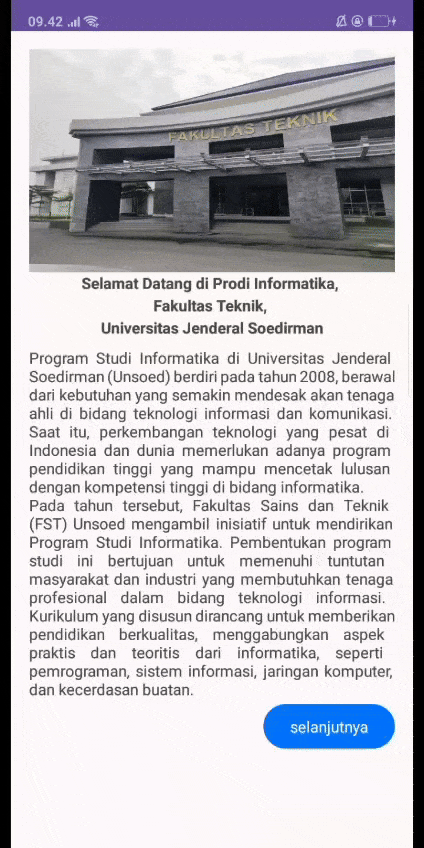

# Praktikum Pemrograman Mobile

**Nama:** Zaizafun Hanifah Zainnur Hanun  
**NIM:** H1D023021  
**Shift KRS:** A  
**Shift Baru:** C  

---

## Deskripsi
Aplikasi ini dibuat untuk memenuhi tugas praktikum mobile.  
Pada halaman utama (`MainActivity`), ditampilkan:  
- Gambar gedung Fakultas Teknik  
- Deskripsi singkat mengenai Program Studi Informatika  
- Tombol untuk melanjutkan ke halaman berikutnya  

---

## Pertemuan 2 - Tugas 1
Berikut merupakan tampilan aplikasi pada **MainActivity**:

  
  
  

---

## Pertemuan 3 - Tugas 2
Demo aplikasi (GIF):

